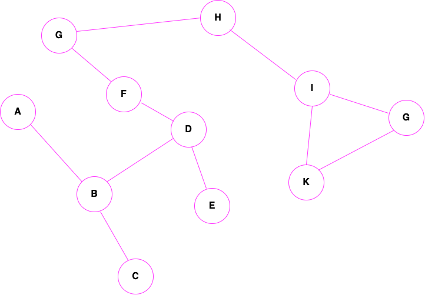

# A*

<a href="https://en.wikipedia.org/wiki/A*_search_algorithm">Описание алгоритма</a>

`f(n) = g(n) + h(n)`

`g(n)` - функция стоимости достижения рассматриваемой вершины (x) из начальной

`h(n)` - функция эвристической оценки расстояния от начальной вершины к конечной

